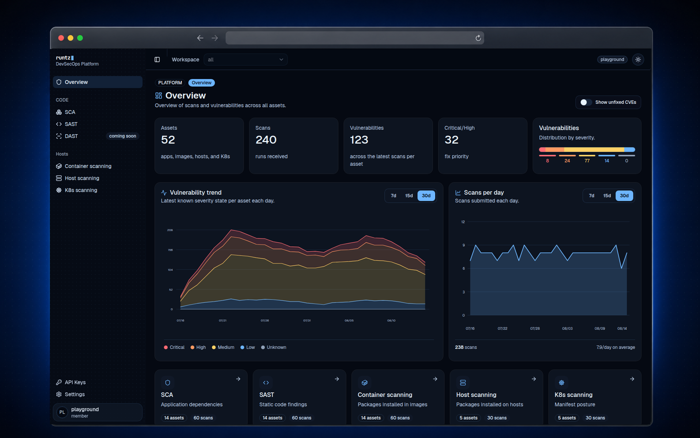
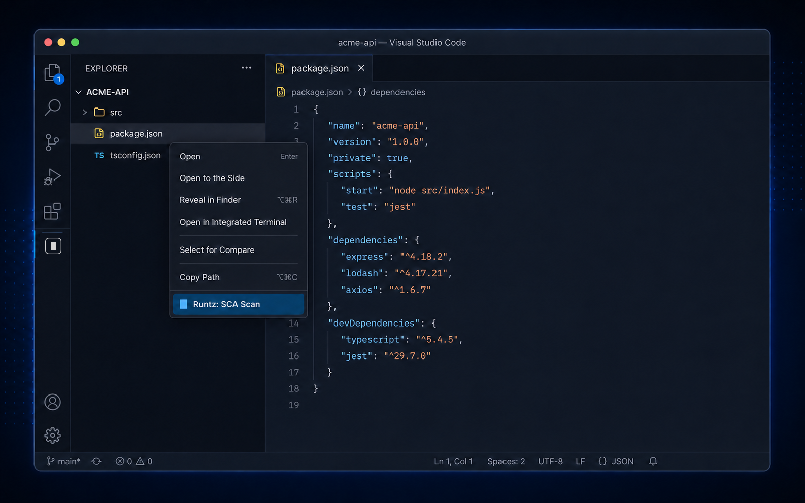

<p align="center">
  <picture>
    <source media="(prefers-color-scheme: dark)" srcset="frontend/public/brand/runtz-logo-dark.svg">
    
  </picture>
</p>

<h1 align="center">runtz</h1>

<p align="center">
  <strong>One security view for your code, dependencies, containers, hosts and Kubernetes.</strong><br>
  Run scans from a single CLI and turn the results into actionable dashboards,
  severity trends and fix priorities.
</p>

<p align="center">
  <a href="LICENSE"></a>
  <a href="https://hub.docker.com/u/runtzdev"></a>
  <a href="helm/runtz/README.md"></a>
  <a href="https://runtz.dev/home/docs"></a>
</p>

<p align="center">
  <a href="https://runtz.dev/playground/overview">Live playground</a>
  ·
  <a href="https://runtz.dev/home/docs">Documentation</a>
  ·
  <a href="https://github.com/runtz-dev/runtz-cli">CLI</a>
  ·
  <a href="https://github.com/runtz-dev/runtz/releases">Releases</a>
</p>

[](https://runtz.dev/playground/overview)

<p align="center"><sub>Explore the dashboard with safe, synthetic data in the live playground.</sub></p>

runtz is a source-available DevSecOps platform. Its scanner CLI sends security
results to a web dashboard that centralizes findings across the software and
infrastructure lifecycle. Use the hosted service or deploy the complete stack
on your own infrastructure with Docker Compose or Helm.

This repository contains the Next.js web platform and the Go backend engine.
The scanner CLI and integrations live in separate repositories so they can be
released independently.

## Scan directly from VS Code

The [Runtz Security extension](https://github.com/runtz-dev/runtz-vscode-extension)
brings the same workflow into the Explorer: right-click a folder to run SAST or
a supported dependency manifest to run SCA, then open the uploaded result in
the Runtz platform.

<p align="center">
  <a href="https://github.com/runtz-dev/runtz-vscode-extension">
    
  </a>
</p>

<p align="center"><sub>The extension delegates scanning to the official Runtz CLI and keeps workspace credentials in VS Code SecretStorage.</sub></p>

## Why runtz

- **One workflow:** use the same CLI locally, in CI/CD and against self-hosted
  or cloud environments.
- **One security view:** compare assets, scans, severity distribution and
  vulnerability trends across every supported scan family.
- **Actionable results:** filter CVEs by fix availability and use severity
  gates to stop a pipeline when a threshold is exceeded.
- **Deploy your way:** start with the hosted platform, Docker Compose or a
  production-ready Helm chart.

## What runtz scans

| Scan | Coverage |
| --- | --- |
| SCA | Dependency manifests for JavaScript/TypeScript, Python, Go, Java/Kotlin, Ruby, PHP, Rust and .NET |
| SAST | Source code findings such as committed secrets, dynamic code execution, disabled TLS verification and weak hashing |
| Container | OS packages inside remote or local container images |
| Host | Installed OS packages on supported Linux distributions and macOS hosts |
| Kubernetes | Live clusters through the current kubectl context or local manifests |

DAST is visible in the platform as a roadmap item and is not implemented yet.
See the [CLI documentation](https://github.com/runtz-dev/runtz-cli) for the
complete compatibility matrix, flags and CI/CD examples.

## Quick start: self-hosted

Start the published platform images and an internal MongoDB instance:

```bash
git clone https://github.com/runtz-dev/runtz.git
cd runtz
docker compose up -d
```

Open [http://localhost:3000/login](http://localhost:3000/login), create the
first admin and workspace, then generate a workspace API key from **API Keys**.
MongoDB stays private to the Compose network; only the frontend and engine are
published to the host.

Install the CLI on Linux or macOS:

```bash
curl -fsSL https://runtz.dev/install.sh | bash
runtz version
```

Or on Windows (PowerShell):

```powershell
irm https://runtz.dev/install.ps1 | iex
runtz version
```

Authenticate once and run your first scan:

```bash
runtz login --endpoint http://localhost:8080 --token rtz_live_...
runtz sca .
```

If ports `3000` or `8080` are already in use, copy `.env.example` to `.env`
and change `FRONTEND_PORT` or `BACKEND_PORT`. To build both application images
from source instead:

```bash
docker compose -f docker-compose.yml -f docker-compose.dev.yml up --build
```

Google Sign-In is optional in self-hosted environments. Set `GOOGLE_CLIENT_ID`
on the engine to enable it. Paid self-hosted plans are activated from the
in-app Billing screen and validated by the central engine at
`https://engine.runtz.dev`.

## Deploy with Helm

```bash
helm repo add runtz https://helm.runtz.dev
helm repo update
helm install runtz runtz/runtz
```

Without an ingress, reach the platform with a port-forward:

```bash
kubectl port-forward svc/runtz-frontend 3000:3000
```

See the [Helm chart reference](helm/runtz/README.md) for persistence, ingress,
external MongoDB, autoscaling, OpenTelemetry and secret configuration. The
[environment overlays](helm/environments/) show how the same chart powers the
runtz development and production environments.

## Run scans

After `runtz login`, the five scan families use the same stored endpoint and
workspace token:

```bash
runtz sca ./
runtz sast ./
runtz host
runtz container ubuntu:22.04
runtz k8s
```

For CI/CD, set `RUNTZ_ENDPOINT` and provide `RUNTZ_TOKEN` from your secret store
instead of storing a local login. Every scan accepts severity gates such as
`--critical-threshold` and `--high-threshold`; a breached threshold returns a
non-zero exit code after the result has been uploaded.

```bash
runtz sca ./ --critical-threshold 1 --high-threshold 5
```

The [runtz-cli repository](https://github.com/runtz-dev/runtz-cli) documents
all commands, environment variables, exit codes, the `runtz update`
self-updater and pipeline examples.

## Platform capabilities

- First-run admin and workspace setup.
- Password authentication for self-hosted deployments, Google Sign-In in both
  modes, and email or GitHub sign-in in cloud deployments.
- Workspace-scoped API keys for CLI ingestion.
- Dashboards and detail views for SCA, SAST, host, container and Kubernetes
  scans.
- CVE fix-availability filters across dashboards and package vulnerability
  results.
- Workspaces, users, profiles, usage tracking and paid-plan billing.
- The app header shows the current account plan next to the deployment mode.
- Cloud workspace owners on Pro or Enterprise can open **Settings → Workspaces
  → Share** to grant access by email to an existing Runtz account, list members,
  and remove access. Members can view scans and manage workspace API keys; only
  the owner manages sharing. New teammates must sign up before being added.
  Pro allows 50 distinct users across the owner's workspaces (including the
  owner); sharing another workspace with an existing teammate uses the same seat.
  Removing a member revokes their workspace API keys. Owners can still remove
  access after downgrading to Free.
- In cloud, deleting a workspace removes its scans and API keys without creating
  a replacement, including after signing in again. Create another from
  **Settings → Workspaces → New workspace**, using the button in the
  **Your workspaces** header. Free includes one owned workspace, with `personal`
  as an editable default name in the creation dialog. Pages without any workspace
  link to these settings.
- Docker Compose and Helm deployments for self-hosting.
- OpenTelemetry traces and metrics for the engine and frontend.

## Repository layout

| Path | Purpose |
| --- | --- |
| [`frontend/`](frontend/) | Next.js, React and shadcn/ui web platform |
| [`engine/`](engine/) | Go API, scan ingestion, dashboard data, authentication and licensing |
| [`helm/runtz/`](helm/runtz/) | Self-hosted Kubernetes chart |
| [`helm/environments/`](helm/environments/) | Development and production overlays used by runtz |

Related projects:

- [runtz-cli](https://github.com/runtz-dev/runtz-cli) — scanner CLI and CI/CD
  severity gates.
- [runtz-mcp](https://github.com/runtz-dev/runtz-mcp) — MCP server for agent
  integrations.
- [runtz-vscode-extension](https://github.com/runtz-dev/runtz-vscode-extension)
  — SCA and SAST scans from VS Code, backed by the installed CLI.

## Development

The easiest way to run the full stack from local source is:

```bash
docker compose -f docker-compose.yml -f docker-compose.dev.yml up --build
```

For component-level development, the repository currently targets Go 1.25,
Node.js 26 and MongoDB 7.

Backend checks:

```bash
cd engine
go test ./...
go vet ./...
```

Frontend checks:

```bash
cd frontend
npm ci
npm run lint
npm run build
```

Helm check:

```bash
helm lint helm/runtz
```

See [CONTRIBUTING.md](CONTRIBUTING.md) for contribution guidance and
[RELEASING.md](RELEASING.md) for the release flow. Versions follow
`1.0.0-rc1 → 1.0.0-rc2 → ... → 1.0.0`, then regular semver; release notes are
kept in [CHANGELOG.md](CHANGELOG.md).

## Community and security

- [Contributing guide](CONTRIBUTING.md)
- [Security policy](SECURITY.md) — report vulnerabilities privately to
  security@runtz.dev
- [Code of Conduct](CODE_OF_CONDUCT.md)

## License

runtz is **source-available** under the
[Business Source License 1.1](LICENSE), the same license model used by
Terraform:

- **Free to use, self-host and modify**, including production use inside your
  organization.
- **Not permitted:** offering runtz to third parties as a competing hosted or
  embedded commercial product. Only RAW DEVOPS LTDA may commercialize the
  platform.
- **Time-delayed open source:** each release converts to
  [MPL-2.0](https://www.mozilla.org/en-US/MPL/2.0/) four years after publication.

### Paid plans and fair use

Scan ingestion uses rolling limits per workspace:

| Plan | Weekly (7 days) | Monthly (30 days) |
| --- | ---: | ---: |
| Free | 250 | 1,000 |
| Pro | 2,500 | 10,000 |
| Enterprise | Unlimited | Unlimited |

Self-hosted Pro and Enterprise features use cryptographically signed licenses.
Removing or bypassing license verification to unlock paid features without an
active subscription breaches the BUSL-1.1. See [NOTICE](NOTICE) for the full
terms.

For commercial licensing, contact licensing@runtz.dev.

---

Copyright © 2026 Runtz · RAW DEVOPS LTDA (CNPJ 51.460.107/0001-53). All rights reserved.

### Workspace regression tests

Use a disposable MongoDB instance and run
`RUNTZ_TEST_MONGO_URI=mongodb://127.0.0.1:27029 go test ./internal/api -run TestCloudWorkspace -v`
from `engine/`. Each test creates and drops a randomly named test database and
covers last-workspace deletion, data removal, repeat sign-in, Free creation and
limits, name collisions, account isolation, and self-hosted permissions. Sharing
coverage includes owner-only management, plan and seat limits, duplicate additions,
member visibility, removal after downgrade, and revocation of member API keys.
